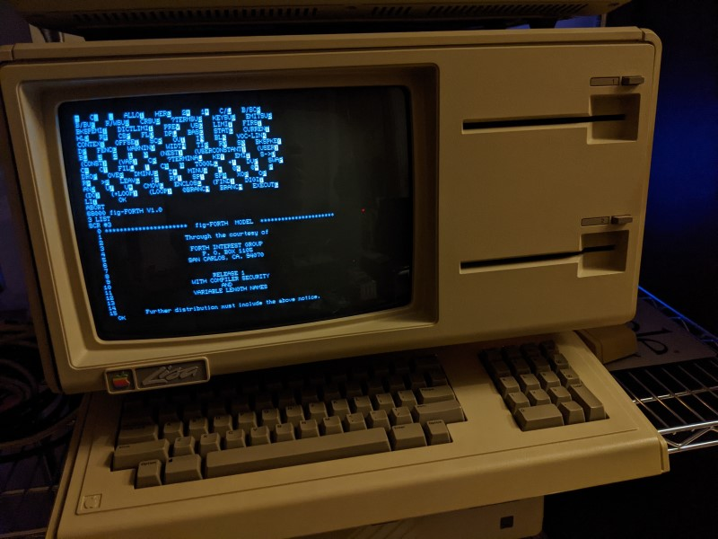

# `lisa-fig68k`: Standalone 68000 fig-Forth for the Apple Lisa

This project is a hasty adaptation of an existing 68000 Forth interpreter to
Apple Lisa computers. It is essentially the combination of two projects:

1. The fig-Forth interpreter in Motorola 68000 assembly language found near the
   bottom of [this webpage](
   https://home.hccnet.nl/a.w.m.van.der.horst/forthimpl.html). This interpreter
   was first written in 1982 by Kenneth Mantei, a California State University,
   San Bernardino chemistry professor, who used a non-standard Forth-styled
   assembly language syntax. In November 1994 (or April 1991?), Peter Nooy,
   Arie Kattenberg, and Albert van der Horst translated the code into standard
   Motorola assembly language syntax and made some small changes.

2. The [lisa_io](https://github.com/stepleton/lisa_io) collection of basic
   low-level I/O routines for the Apple Lisa computer. The Forth interpreter
   has "fill-in-the-blank" sections for screen, keyboard, and disk I/O, and
   this library provides all three of those.

**Note:** This project was undertaken as a weekend project by someone who is
not a Forth programmer. True Forth aficionados are thanked for suffering a
tourist and are encouraged to [drop me a line](mailto:stepleton@gmail.com) if
information in this README is incorrect or misleading.

## Background

_Note: This introductory information derives from information I've gathered
from various online sources in a limited amount of time, and it may not be
accurate in all details. As mentioned, please feel free to [e-mail
me](mailto:stepleton@gmail.com) with corrections and clarifications._

**What's Forth?**
[Forth](https://en.wikipedia.org/wiki/Forth_(programming_language)) is an
intriguing [stack-oriented](
https://en.wikipedia.org/wiki/Stack-oriented_programming), [concatenative](
https://en.wikipedia.org/wiki/Concatenative_programming_language) and
sometimes [untyped](
https://en.wikipedia.org/wiki/Programming_language#Type_system) programming
language that was especially popular on microcomputers and other small computer
systems and constrained computing environments in the 1970s, '80s, and '90s.
Forth interpreters were often renowned for being small and for facilitating
fast code, particularly in comparison to other microcomputer-associated
programming languages like BASIC. Forth still finds some use today, and the
language and a few variants are under active development.

**What's fig-Forth?**
The Forth Interest Group (FIG) was established in the 1970s to promote and
support the use of Forth (see the first page of [Vol. 1, No. 1 of _Forth
Dimensions_](http://www.forth.org/fd/FD-V01N1.pdf), their newsletter). Among
their early undertakings was the creation of free Forth interpreter
implementations for numerous computer systems available at the time (see the
last page of that same newsletter). These interpreters were distributed as
["model interpreters"](https://www.taygeta.com/forth/dpansd.htm#D.1) and so by
design had a great number of idioms and facilities in common, forming a kind of
de-facto standard prior to the establishment of more formal standards like [ANS
Forth](https://www.taygeta.com/forth/dpans.html) and predecessors. The phrase
"fig-Forth" could either refer to one of these interpreters specifically or to
the informal standard that they implied.

**How can I learn to use fig-Forth?**
The fig-Forth glossary in [this combined document](
https://web.archive.org/web/20180517091622/http://wiki.yak.net/1089/fig-FORTH_Manuals_May79.pdf)
may be a useful reference. For more general introductions to Forth, [_Starting
Forth_]( https://www.forth.com/starting-forth/0-starting-forth/) is apparently
a classic. I've also enjoyed reading the [_Jupiter ACE Users Manual_](
http://jupiter-ace.co.uk/usermanual.html) by [Steve Vickers](
https://en.wikipedia.org/wiki/Steve_Vickers_(computer_scientist%29): it
describes a different dialect of Forth but is an enjoyable introduction to the
languuage.

**What else?**
lisa-fig68k is hardly the first opportunity to boot a 32-bit Apple computer
into a standalone Forth. Most PowerPC Macintosh computers offered this same
luxury by incorporating [Open Firmware](
https://en.wikipedia.org/wiki/Open_Firmware) in their boot ROMs, not too
unlike the Jupiter ACE.

## About this Forth

"The Forth language is its own operating system and text editor," says Page 1
of the first _Forth Dimensions_ newsletter, linked above. This is basically
true of `lisa-fig68k`, although both are rudimentary by Lisa standards (and in
fact the implementation of the fig-Forth text editor is for you to finish and
type in yourself --- see the final four pages of the combined document linked
above). As distributed here, `lisa-fig68k` can print text to the screen
(without cursor control), gather input from the keyboard, and read and write
1024-byte screens to whatever hard disk it was loaded from. It can only make
use of 32 KiB of the Lisa's 1 MiB (typical) of RAM, and perhaps a quarter of
that is already claimed by the interpreter and system facilities. There is no
built-in support for graphics, the floppy drives, the mouse, serial ports,
printers, or parallel ports not used by the hard drive.

A dedicated Forth programmer knowledgeable about 68000 programming and Apple
Lisa internals should be able to overcome all of these limitations without
any additional facilities.

`lisa-fig68k` includes two extra words not included in the fig-Forth model
interpreter:

* `BYE` -- quit Forth and return to the boot ROM user interface.

* `HOME` -- clear the screen and return the cursor to the topmost, leftmost
  position.

There are additional variations from canonical fig-Forth introduced by Kenneth
Mantei (the interpreter's original author) and Nooy et al. (the people who
transcribed Mantei's code it into Motorola-syntax assembly). Refer to [the
documentation supplied with the original interpreter](original/F68K.txt) for
more details.

## User interface notes

### The Clear key might be a break key

The `?TERMINAL` word in fig-Forth pushes a 1 to the stack if it detects that
the user has just pressed the "break" key, otherwise it pushes a 0. A Lisa
doesn't have a break key, but in `lisa-fig68k` the Clear key has been set up
to work as a substitute, or at least that is the goal.

### Accessibility

`lisa-fig68k` has poor accessibility for people with certain kinds of visual
impairments. Other shortcomings may exist.

If you are having trouble using `lisa-fig68k` due to any of its accessibility
limitations, please [contact me via email](mailto:stepleton@gmail.com).

## Installation and usage

Because `lisa-fig68k` cannot use the floppy drive, it is distributed as a
(compressed) 5 MB ProFile hard drive image, in three separate formats:

* [forth.dc42.zip](forth.dc42.zip) -- DC42 format, suitable for use with the
  LisaEm hard drive emulator.

* [forth.blu.zip](forth.blu.zip) -- BLU format, useful for transmitting to a
  Lisa running [BLU](http://sigmasevensystems.com/BLU.html) for installation
  on a ProFile hard drive or a hard drive emulator.

* [forth.image.zip](forth.image.zip) -- "Raw" format, compatible with the
  [Cameo/Aphid](https://github.com/stepleton/cameo/tree/master/aphid) ProFile
  emulator and the [IDLE Lisa emulator](http://idle-lisa-emu.sourceforge.net/).

These applications all use hard drive images in different ways --- refer to
the appropriate documentation for details. In general, what you need to do is
get your software (or real-life Lisa) to recognise the disk image data as a
hard drive and then boot from it.

When `lisa-fig68k` is ready for your input, you'll see a black screen with the
text `68000 fig-FORTH V1.0` and a blinking cursor. It is easy to run "hello
world": just type

    CR ." Hello, world!" CR

(mind the space after the first `"`) and press Return. From here on I can
advise you no further --- you'll need to find a friendly Forth programmer for
guidance on what to do next. Once you've had enough Forth, type `BYE` and press
Return to return to the boot ROM user interface.

Or, if you prefer, you can just divide a number by zero. This will promptly
crash the interpreter and return you to the ROM as well.

## What files make up the `lisa-fig68k` code repository?

Files in the [original_fig68k_distribution](original_fig68k_distribution)
directory are, as the name suggests, the original unmodified fig68k source code
files and documentation from [Albert van der Horst's webpage](
https://home.hccnet.nl/a.w.m.van.der.horst/forthimpl.html). See its
[README.txt](original_fig68k_distribution/README.txt) for details. I include
them here for convenient study and context; it's important to remember that
these files are all the product of the hard work of Nooy, Kattenberg, van der
Horst, and originally Mantei. It's difficult for me to say with any legal
certainty who owns those files; the FIG uses the phrase "public domain" in
several places, though sometimes with phrases that admonish you to "include the
above notice" and suchlike. (I don't think requirements like that are so
compatible with most definitions of "public domain", but I'm no lawyer.) It's
also unclear whether Nooy et al. consider their translated code to be public
domain, but I hope that they might not mind its replication here in what I
guess to be the original FIG spirit.

In the current directory, [F68K.ASM](F68K.ASM) is the Nooy et al. `fig68k`
interpreter source code with light modifications to hook into Lisa-specific I/O
code in [forth.x68](forth.x68). In addition to the I/O code, that file also
contains the start-up code for the interpreter; as it's an entirely new
creation by me, forth.x68 is properly and completely forfeited into the public
domain. Returning to hazy ownership grounds, we have [screens.x68](
screens.x68), which contains error messages and other text resources for the
interpreter copied verbatim from the fig-Forth glossary etc. document linked
above. Helpfully, the phrase "Further distribution must include the above
notice" (sigh), so, it does.

Finally, we have this README.md file and the above image, along with the
[build.sh](build.sh) build script, all originals from me. I dedicate all three
of these files and their contents to the public domain.

## Building `lisa-fig68k`

Refer to the cheap-and-cheerful [build.sh](build.sh) build script for
information on building `lisa-fig68k` from source. The software utilities
used to develop `lisa-fig68k` include

* the [EASy68k command-line assembler](
  https://github.com/rayarachelian/EASy68K-asm) distributed by Ray Arachelian,
* my own [Apple Lisa hard drive bootloader](
  https://github.com/stepleton/bootloader_hd), and
* the `srec_cat` utility from the [srecord project](
  http://srecord.sourceforge.net/),

but only the middle item would be hard to replace with an equivalent utility.
(This is because `lisa-fig68k` makes use of hard drive routines that the
bootloader places in RAM prior to starting the interpreter.)

## Technical details about this port

**Notes on hard drive organisation.**
In fig-Forth, data on the hard drive is organised into 1024-byte "screens".
The interpreter uses screens 3, 4, and 5 for a "splash screen" and the
interpreter's error messages. If you'd like to see them one-by-one, enter
`3 LIST`, `4 LIST`, and `5 LIST` into the interpreter, pressing Return
after each command.

In `lisa-fig68k`, the data from screens 3-5 are loaded into RAM when the
interpreter starts and are not actually stored in the user-writable region of
the hard drive. Reads from those screens load the data from RAM; writes to them
do nothing at all (although no errors will be reported). The effect is akin to
screens 3, 4, and 5 being read-only regions of the disk.

The hard drive layout for a `lisa-fig68k` installation is as follows:

    Blocks $000000-$000001: Bootloader
    Blocks $000002-$000016: Interpreter code and data
    Blocks $000017-$000018: Screen 0
    Blocks $000019-$00001A: Screen 1
    Blocks $00001B-$00001C: Screen 2
    Blocks $00001D-$00001E: Screen 6
    Blocks $00001F-$000020: Screen 7
    Blocks $000021-$000022: Screen 8
       ... and so on

Note how screens 3-5 are absent in this scheme. This gap is administered
automatically by the "XRSLW" disk driver in [forth.x68](forth.x68). As for
where Screen 0 begins, `lisa-fig68k` scans through drive blocks at boot time
until it finds a block that has only $00 bytes for block tag bytes $04..$07:
this block is considered to be start of the user-writable region of the hard
drive from then on.

**Notes about `lisa-fig68k`'s "at rest" space-saving scheme.**
The [bootloader](https://github.com/stepleton/bootloader_hd) that `lisa-fig68k`
uses is very simple: it loads successive drive blocks into RAM and begins
execution at the first block. Since a freshly-booted `lisa-fig68k` essentially
has two "interesting" memory regions separated by several kilobytes of empty
space (which is where your code goes), a replication of this layout on disk
would waste a number of blocks and would leave users waiting for the bootloader
to load a whole lot of meaningless $00 bytes from the hard drive.

No doubt `lisa-fig68k` could benefit from a proper compression scheme for its
code and data. It has a cheaper substitute instead: it just stores the two
"interesting" memory regions next to each other on disk; then, shortly after
this data is loaded into RAM by the bootloader, the start-up code moves the
second memory region to the part of RAM where it belongs. See the code just
past the start of [forth.x68](forth.x68).

## Miscellaneous

Thanks to the hard work of Nooy, Kattenberg, and van der Horst, `fig68k` was
straightforward to port to the Apple Lisa. It is an old and fairly-constrained
Forth implementation, however, and cannot make easy use of most of the Lisa's
RAM or its graphical display, among other facilities. If I had been aware of it
before starting on this project, I might have chosen to port the more capable
[F68KANS](https://github.com/cstrotm/f68kans), although I'm somewhat glad I
wasn't (otherwise I'd have spent even more time on porting an interepreter for
a language I don't really know).

-- [_Tom Stepleton_](mailto:stepleton@gmail.com), 5 March 2021, London
